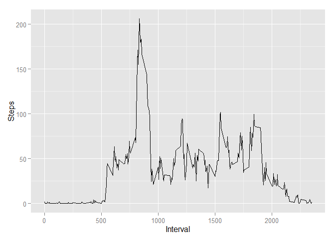
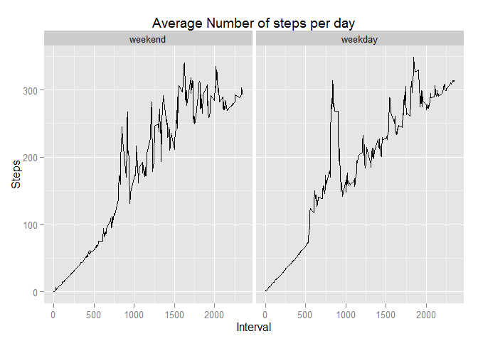

# Reproducible Research: Peer Assessment 1


## Loading and preprocessing the data

```r
require(utils)
require(dplyr)
if(!file.exists("activity.csv")) {
  unzip("activity.zip")
}
data<- read.table("activity.csv",header=TRUE,sep=",")

# Assignment: always use: echo=TRUE
knitr::opts_chunk$set(echo=TRUE)
# Assignment: If your document has figures ... in the figures/ directory
knitr::opts_chunk$set(fig.path='figures/')
knitr::opts_chunk$set(message=FALSE)
knitr::opts_chunk$set(cache=TRUE)

addWorkDay<- function(data) {
  loc<- Sys.getlocale("LC_TIME")
  Sys.setlocale("LC_TIME", "English")
  data$Weekday<- weekdays(as.Date(data$date))
  data<- mutate(data, Workday = Weekday %in% c("Monday","Tuesday","Wednesday", "Thursday", "Friday"))
  data<- mutate(data, Daytype = factor(Workday, labels= c("weekend","weekday")))
  Sys.setlocale("LC_TIME", loc)
  
  return(data);
}

data<- addWorkDay(data)
```

## What is mean total number of steps taken per day?

```r
require(ggplot2)
data_nna<- na.omit(data)

smean<- mean(data_nna$steps)
rmed<- median(data_nna$steps)

ggplot(data, aes(x=steps)) + geom_histogram(binwidth=25,fill="red") + labs(title="Histogram of total number of steps per day", x = "Steps", y = "Count")
```

 

The mean number of steps is 37.3825996 the median is 0. 

## What is the average daily activity pattern?


```r
# library(scales) # to access breaks/formatting functions
# scale_x_date(labels = date_format("%d %H:%M"), breaks = date_breaks("5 minutes"))

#Creating the average data
dd<- aggregate(data_nna$steps, by=list(data_nna$interval), mean)
colnames(dd)<- c("Interval","Steps")

#Part 2 of the question
idx<- which.max(dd$Steps)
interval<-dd$Interval[idx]

ggplot(dd, aes(Interval, Steps)) + geom_line()
```

 

The 5-minute interval, for the average across all the days in the dataset,
containing the maximum number of steps is 835. 

## Imputing missing values
### Total number of missing values in the data set
The total number of missing value in the dataset is 2304. Which can be calculated using `sum(is.na(data))`

### Strategy for imputation
One strategy for imputing the missing values could be do devise the data into weekdays and weekenddays calculating the average steps for every interval and using that data for imputing the missing values. 


```r
require(dplyr)
# dd<- aggregate(data_nna$steps, by=list(data_nna$interval), mean)
# colnames(dd)<- c("Interval","Steps")
impute<- function(data) {
  data_help<- na.omit(data)
  
  work<- data_help %>% filter(Workday == TRUE) %>% group_by(interval) %>%   summarise(m=mean(steps))
  weekend<- data_help %>% filter(Workday == FALSE) %>% group_by(interval) %>% summarise(m=mean(steps))
  missing<- which(is.na(data))
  for(idx in missing) {
    if( data$Workday[idx] ){
      data$steps[idx]<- work[work$interval==data$interval[idx],][[1]]
    } else {
      data$steps[idx]<- weekend[weekend$interval==data$interval[idx],][[1]]
    }
  }
  
  return(data);
}

data_imputed<- impute(data)
```

### Steps taken each day

```r
imean<- mean(data_imputed$steps)
imed<- median(data_imputed$steps)

ggplot(data_imputed, aes(x=steps)) + geom_histogram(binwidth=25,fill="red") + labs(title="Histogram of total number of steps per day", x = "Steps", y = "Count")
```

 

The mean number of steps in the imputed data is 186.9061931 the median is 0. While the median does not differ the mean value differs by a factor of 5.
The reason for this is that the mean is a instable meassure. 


## Are there differences in activity patterns between weekdays and weekends?


```r
# library(scales) # to access breaks/formatting functions
# scale_x_date(labels = date_format("%d %H:%M"), breaks = date_breaks("5 minutes"))

data_imputed %>% 
  #Creating the average data
  group_by(Daytype, interval) %>% summarise(Steps=mean(steps)) %>%
  # Creating the plot
  ggplot(aes(interval,Steps)) + geom_line() + 
  # Plots 2 Variables
  facet_grid(. ~ Daytype) + 
  labs(title="Average Number of steps per day", x = "Interval", y = "Steps")
```

 
